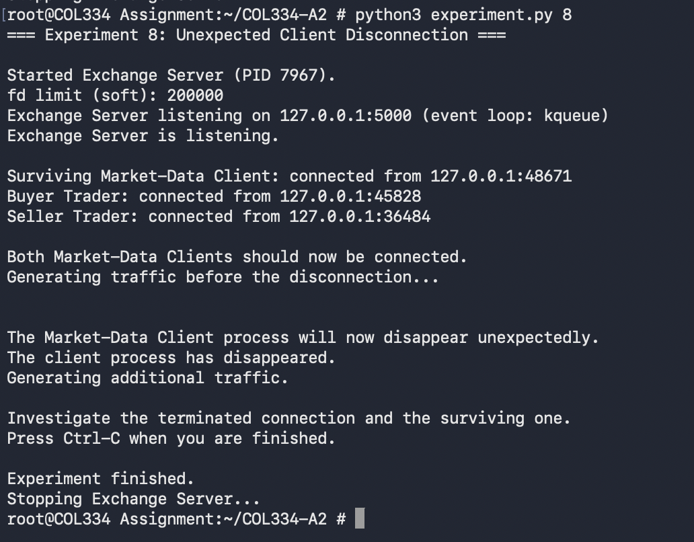
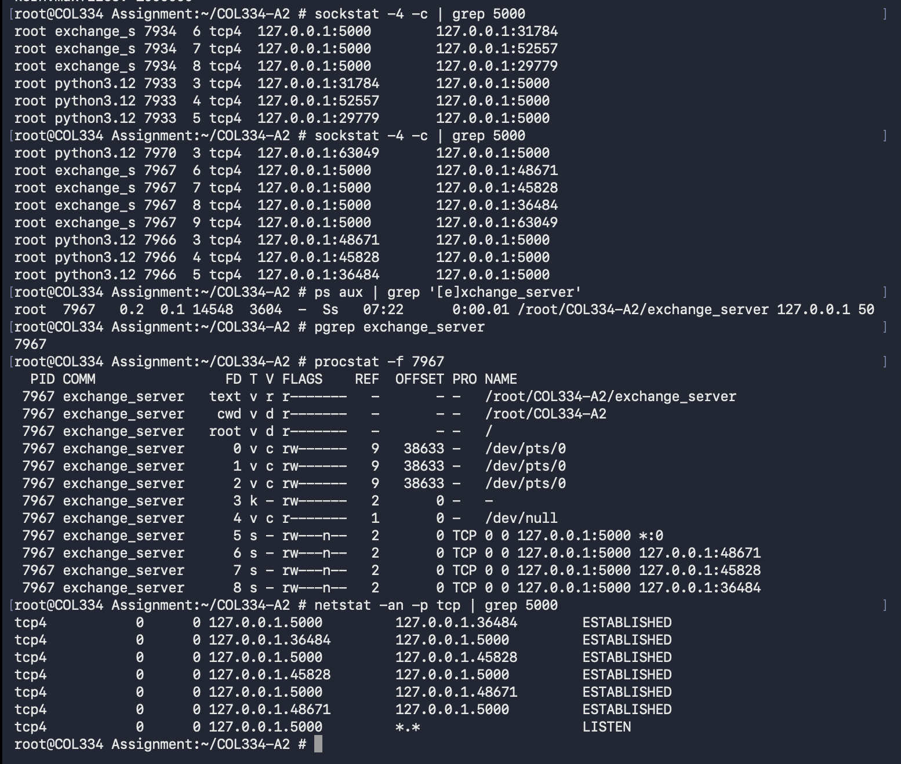
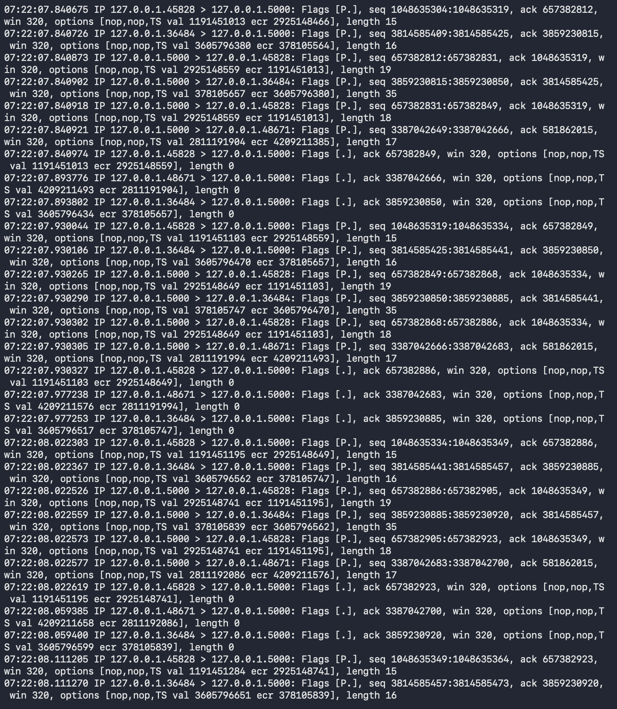
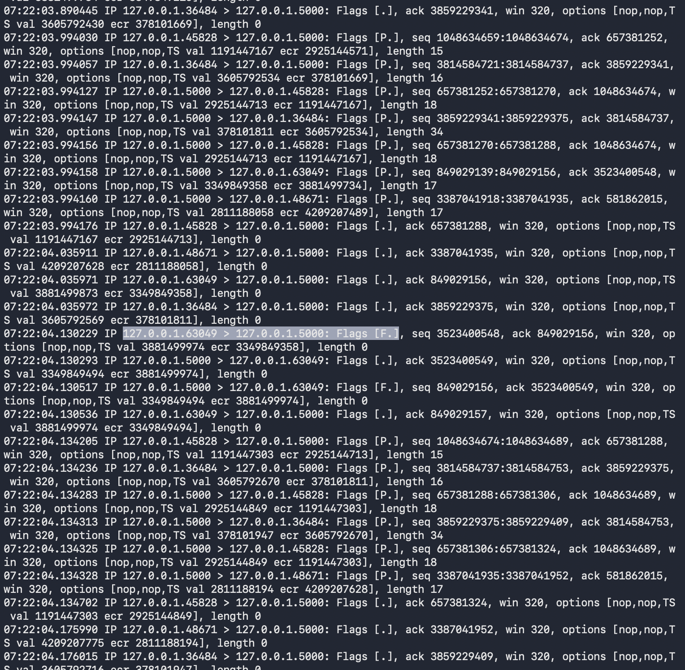
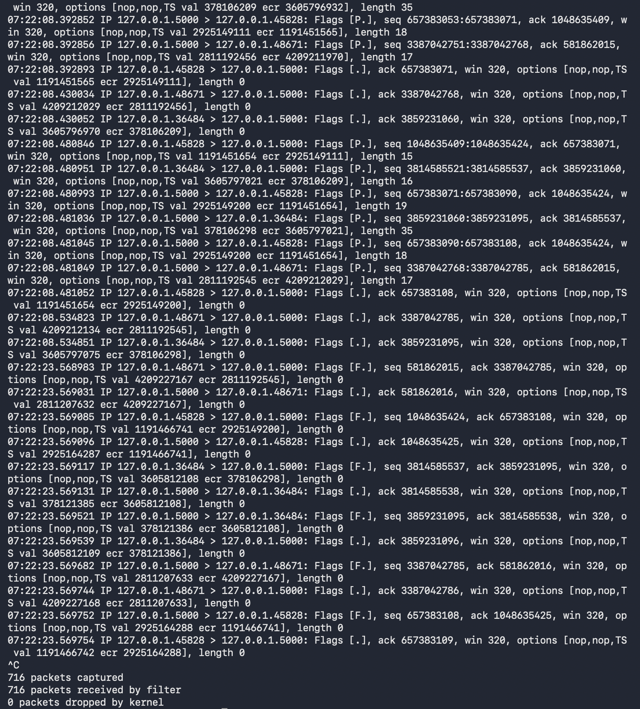

# COL334 Assignment 2 — The Socket Exchange
## Experiment Report

**Team:** Avvaru Yasasvi (2024CS10063), Hardhik Reddy (2024CS10466)
**Language / build:** C++17, built with the system `c++` (FreeBSD base clang) via `make`.
**Environment:** FreeBSD 14.4-RELEASE (amd64) in VirtualBox, 4 GB RAM / 20 GB disk.

---

## Build and setup

```sh
make
./server/run-server 127.0.0.1 5000
```

`make` builds `exchange_server`, `trader_client`, and `market_data_client`.
The server prints its listening address and the event loop it was built with
(`poll` by default).


---

## Implementation Decisions

### Concurrency / I/O mechanism

The Exchange Server is a **single process with a single thread running one
event-driven readiness loop**. Every socket — the listening socket and every
client connection — is set non-blocking. The loop:

1. calls a readiness primitive that blocks until at least one socket needs
   attention;
2. `accept()`s all pending connections if the listening socket is ready;
3. for each ready client, `recv()`s available bytes into a per-connection
   input buffer, splits it on `\n`, and processes each complete message;
4. `send()`s as much of each client's queued output as the kernel accepts,
   keeping the remainder for later.

The readiness primitive is selected at build time through a small abstraction
(`src/event_poller.hpp`):

| Build | Primitive | Purpose |
|---|---|---|
| `make` (default) | `poll(2)` | portable; used for grading and all experiments below |
| `make POLLER=kqueue` | `kqueue` | O(ready) wakeups; used for the §6.9 scalability bonus |
| `make POLLER=epoll` | `epoll` | Linux-only, for cross-checking on a Linux host |

### Why this design

* **Isolation.** The assignment requires that one idle, slow, or
  abruptly-disconnecting client never disturbs the others (§4.3, §4.4). With a
  single `poll()` loop and non-blocking sockets the server never blocks inside
  `recv()` or `send()` for any one client — it only ever blocks in the
  readiness wait, which watches *all* clients simultaneously.
* **Cost.** No per-connection thread/process means no per-connection stack or
  scheduler overhead: application state is ~0.3 KB per connection, and the
  server holds 70 000 idle connections in ~26 MB RSS on the default `poll`
  build, ~44 MB on the `kqueue` build (measured, §6.9). A thread-per-connection
  design would hit thread-stack and lock-contention limits well before the
  70 000-connection bonus target, for a workload that is I/O-bound rather than
  CPU-bound.
* **Observability.** A single explicit loop makes the underlying TCP
  behaviour — byte-stream framing, partial reads/writes, backpressure,
  FIN/RST detection — directly visible, which is the purpose of the
  experiments.

### Other decisions relevant to networking

* **Message framing.** Per-connection byte buffer, split on `\n` (a trailing
  `\r` is tolerated). A read cursor is advanced instead of erasing from the
  front, so re-framing is linear, not quadratic. A 64 KiB per-connection input
  cap is a safety valve for out-of-spec input; hitting it closes only that one
  connection.
* **Output queueing.** One contiguous per-connection output buffer plus a
  write offset. On `EAGAIN` the unsent tail is kept and write-interest is
  registered with the readiness loop; it drains on a later iteration. An 8 MiB
  cap bounds a non-reading client (§ Experiment 7); exceeding it drops that one
  connection.
* **Order book.** Per `(instrument, side)`: `std::map<price, list<Order>>`,
  FIFO within a price level, plus `unordered_map<order_id, iterator>` for O(1)
  `CANCEL`. Matching occurs only at an exactly equal price (§2.6).
* **Roles.** A connection is unassigned until its first command: `LOGIN`
  ⇒ Trader, `SUBSCRIBE`/`UNSUBSCRIBE` ⇒ Market-Data. A command not permitted
  for the established role is answered with `ERROR` and ignored (§4.5).
* **Connection lifetime.** A resting order is keyed to the submitting
  connection, not the username. It survives that client's disconnect and can
  still match later; no `BOUGHT`/`SOLD` is sent to the departed client, but
  subscribers still receive the `TRADE` (§2.6, confirmed on Piazza).
* **Scalability.** At startup the server raises its own `RLIMIT_NOFILE` soft
  limit to the hard limit, does **not** pin `SO_SNDBUF`/`SO_RCVBUF` (which
  would reserve tens of GiB across 70 000 sockets), and, when the descriptor
  ceiling is reached, rejects new connections without crashing or busy-spinning.

---

## Experiment 1 — Listening and Connected Sockets

**Run:** `python3 experiment.py 1`

**Question.** After the client has connected, identify the TCP sockets
associated with the Exchange Server. How does the listening socket differ from
the socket representing the connection to the client?

**Approach.** Start the experiment (server + one idle client). In a second
terminal, list the server's sockets and the server process's open file
descriptors, and read the TCP state and endpoint columns.

**Commands / tools.**
```sh
sockstat -4 | grep ':5000'
netstat -an -p tcp | grep '\.5000'
procstat -f $(pgrep exchange_server)
```

**Observation.** With the experiment client connected, `sockstat` showed the
server process (`exchange_s`, PID 6674) holding two sockets, and the client
(`python3`, PID 6673) holding one:

```
USER  COMMAND     PID   FD PROTO LOCAL ADDRESS      FOREIGN ADDRESS
root  exchange_s  6674  4  tcp4  127.0.0.1:5000     *:*
root  exchange_s  6674  5  tcp4  127.0.0.1:5000     127.0.0.1:51829
root  python3.12  6673  3  tcp4  127.0.0.1:51829    127.0.0.1:5000
```

`netstat -an` showed the matching TCP states:

```
127.0.0.1.5000    127.0.0.1.51829   ESTABLISHED
127.0.0.1.51829   127.0.0.1.5000    ESTABLISHED
127.0.0.1.5000    *.*               LISTEN
```


**Answer.** The server has two kinds of TCP socket. The **listening socket**
(server FD 4, from `socket()` + `bind()` + `listen()`) is in state `LISTEN`,
is bound to `127.0.0.1:5000`, and has no foreign address (`*:*`). It carries no
data; it only produces new connections through `accept()`. The **connected
socket** (server FD 5, returned by `accept()`) is in state `ESTABLISHED` and
has a full four-part address: local `127.0.0.1:5000` and the specific remote
`127.0.0.1:51829` (the client's end, its FD 3). Application data flows only on
the connected socket. The two are separate file descriptors, and because the
listening socket stays in `LISTEN` the server can still accept more clients
while talking to this one.

---

## Experiment 2 — Observing TCP Connection States

**Run:** `python3 experiment.py 2`

**Question.** How does the TCP state of the client–server connection change
during its lifetime, and what events cause the observed state changes?

**Approach.** Observe the connection at three points the harness pauses for:
(1) while it is being established, (2) while established and idle, (3) after
the client closes it. Capture packets throughout to correlate states with
segments.

**Commands / tools.**
```sh
tcpdump -i lo0 -n 'tcp port 5000'          # in a terminal before the run
netstat -an -p tcp | grep '\.5000'         # repeat at each phase
sockstat -4 | grep ':5000'
```

**Observation.** During phase 1 (client connected and idle), `netstat` showed
the connection `ESTABLISHED` at both ends, with the server still `LISTEN`ing
(client ephemeral port 16831):

```
127.0.0.1.5000    127.0.0.1.16831   ESTABLISHED
127.0.0.1.16831   127.0.0.1.5000    ESTABLISHED
127.0.0.1.5000    *.*               LISTEN
```

After the client closed, the `ESTABLISHED` rows were gone and only the
listening socket remained:

```
127.0.0.1.5000    *.*               LISTEN
```

We did not catch an intermediate `CLOSE_WAIT` or `TIME_WAIT` row; by the time
the periodic `netstat` ran, the connection had already left the table.


**Answer.** The connection reaches `ESTABLISHED` after the three-way handshake
(SYN, SYN-ACK, ACK) and stays there, with no packets, while idle. When the
client calls `close()` it sends a FIN. On the server side `recv()` returns 0,
the server closes that socket, and the connection is torn down with the normal
FIN/ACK exchange from both sides. The transient states on the way down
(`CLOSE_WAIT` on the server, `FIN_WAIT_2` and `TIME_WAIT` on the client that
closed first) last only milliseconds here, so our periodic `netstat` did not
capture them; what we can show is `ESTABLISHED` before the close and the
connection gone afterwards. The listening socket stayed in `LISTEN` the whole
time, so closing one client did not affect the server.

---

## Experiment 3 — TCP as a Byte Stream

**Run:** `python3 experiment.py 3`

**Question.** Does the Exchange Server receive the application-level message as
one complete unit, or can it be received in multiple pieces? Explain what this
demonstrates about the relationship between TCP and application-level message
boundaries.

**Approach.** The harness sends the single message
`LOGIN experiment_trader\n` as four separate `send()` calls
(`"LOGIN "`, `"experiment"`, `"_trader"`, `"\n"`) with pauses between them.
Watch the segments on the wire and the server's `recv()` syscalls, and confirm
the server only replies `OK` after the final `\n`.

**Commands / tools.**
```sh
tcpdump -i lo0 -n -X 'tcp port 5000'
truss -f -p $(pgrep exchange_server)        # or: ktrace -p <pid> ; kdump
```

**Observation.** `tcpdump` showed the four writes arriving as four separate
data-carrying segments, each pushed about 0.2 s after the previous one (which
matches the delay the harness inserts):

| Time | TCP seq | Length | Bytes | Text |
|---|---|---:|---|---|
| 04:15:06.084075 | 1:7   | 6  | `4c 4f 47 49 4e 20` | `LOGIN ` |
| 04:15:06.287146 | 7:17  | 10 | `65 78 70 65 72 69 6d 65 6e 74` | `experiment` |
| 04:15:06.488136 | 17:24 | 7  | `5f 74 72 61 64 65 72` | `_trader` |
| 04:15:06.688994 | 24:25 | 1  | `0a` | `\n` |

About 1.4 ms after the newline arrived, the server sent its reply:

| 04:15:06.690381 | server → client | 3 | `4f 4b 0a` | `OK\n` |

The kernel reported 0 packets dropped.


**Answer.** The message arrived in pieces, not as one unit. Each segment
carried only the bytes written so far. The server appended them to that
connection's input buffer and did nothing until the `\n` appeared in the
buffer; then it parsed `LOGIN experiment_trader` and replied `OK\n`. This shows
that TCP is an ordered byte stream with no message boundaries: one `send()` on
the client does not become one `recv()` on the server, and a message can be
split anywhere. The application must add its own framing, which here is the
newline delimiter. (TCP is also free to *combine* writes into one segment; this
run happened to keep them separate because of the 0.2 s gaps.)

---

## Experiment 4 — One Client Should Not Stall the Others

**Run:** `python3 experiment.py 4`

**Question.** When Client 1 remains connected but sends no data, can the
Exchange Server still accept and service Client 2? Identify the server
operation that determines the answer.

**Approach.** Client 1 connects and sends a partial line
(`LOGIN blocked_client`, no newline), then stays silent. Two seconds later
Client 2 connects and sends a complete `LOGIN active_client\n`; the harness
times how long the `OK` takes. While Client 1 is idle we list the server's
open sockets with `procstat` to confirm both connections exist.

**Commands / tools.**
```sh
procstat -f $(pgrep exchange_server)        # the server's open sockets
sockstat -4 | grep ':5000'
```

**Observation.** The harness reported `Client 2 response: 'OK'` with
`Elapsed time: 0.000 seconds`, even though Client 1 had sent only
`LOGIN blocked_client` (no newline) and then gone silent.

`procstat -f` on the server (PID 6712) showed three TCP sockets at that moment:

```
FD 4  TCP  127.0.0.1:5000   *:0                 (listening)
FD 5  TCP  127.0.0.1:5000   127.0.0.1:37591     (Client 1)
FD 6  TCP  127.0.0.1:5000   127.0.0.1:53905     (Client 2)
```

So both clients were connected at the same time, and Client 2 got its reply
immediately. (`truss` attached but did not print useful syscall lines before
we detached, so we do not rely on it here.)


**Answer.** Yes. Client 2 was served in 0.000 s while Client 1 sat idle with an
incomplete message. The operation that decides this is the server's `poll()`
call. It is the only place the server blocks, and it waits on every socket at
once. All sockets are non-blocking, so the server never sits inside `recv()`
or `send()` for one client. Client 1 having no data just means `poll()` does
not list it as ready; `poll()` still lists the listening socket and Client 2,
which are handled normally. A blocking `recv()` on Client 1 would have frozen
the whole server. The server also prints `event loop: poll` at startup, and the
source (`src/server.cpp`, `poll_once()`) confirms the mechanism.

---

## Experiment 5 — Multiple Clients and I/O Multiplexing *(optional)*

**Run:** `python3 experiment.py 5`

**Question.** At a particular point during the experiment, which client
connections are actually ready for the server to service, and what evidence
from the running system allows you to determine this?

**Approach.** Five connections are opened (client ports 14226, 26960, 27683,
30524, 57599); clients 1, 3, and 5 send a `LOGIN`, clients 2 and 4 stay idle.
We list the server's sockets, look at the per-socket queue lengths in
`netstat`, and watch the server with `truss`.

**Commands / tools.**
```sh
sockstat -4 -p 5000
netstat -an -p tcp | grep '\.5000'         # Recv-Q / Send-Q columns
truss -p $(pgrep exchange_server)
```

**Observation.** `sockstat` showed the server (PID 6769) holding six sockets:
FD 4 listening, and FD 5–9 for the five clients. All five connections were
`ESTABLISHED` in `netstat`. On the server side every `Recv-Q` was 0 — the
server had already read and replied to clients 1, 3, and 5. On the client side,
the three that sent a `LOGIN` (ports 14226, 27683, 57599) each showed
`Recv-Q = 3`, the unread `OK\n` reply; the two idle clients (26960, 30524)
showed `Recv-Q = 0`. `truss` showed the server making a single `recvfrom` on
one client fd and otherwise sitting idle until the experiment stopped it.


**Answer.** All five connections are `ESTABLISHED`, but only the ones with data
to move are ever "ready" for the server. Clients 1, 3, and 5 sent a `LOGIN`; the
server was woken for those sockets, read the request, replied `OK`, and went
back to waiting. Clients 2 and 4 sent nothing, so `poll()` never reports them
and the server does no work for them. At the moment of capture the server-side
`Recv-Q` is 0 everywhere (all pending input already consumed); the only trace
of activity is the 3-byte `OK` reply queued in the receive buffers of the three
clients that spoke. This shows that "connected" and "ready for service" are not
the same thing — the server only touches a socket when that socket has
something to read or write.

---

## Experiment 6 — FIN vs. RST: Orderly and Abrupt Termination

**Run:** `python3 experiment.py 6`

**Question.** How does an abrupt client termination differ from the orderly
shutdown? Identify the TCP event observed on the network and the corresponding
behaviour of the Exchange Server's socket.

**Approach.** Part A: the client calls `shutdown(SHUT_WR)` (orderly). Part B: a
second client sets `SO_LINGER` to `{on, 0}` and closes (abortive). Capture the
packets and the server-side socket state for each.

**Commands / tools.**
```sh
tcpdump -i lo0 -n -S 'tcp port 5000'       # compare F (FIN) vs R (RST)
netstat -an -p tcp | grep '\.5000'         # socket state after each part
```

**Observation.** The orderly client used port 19512, the abrupt client
port 50393.

*Part A (orderly).* `tcpdump` showed the client send a **FIN** (`Flags [F.]`)
at `04:30:27.961625`; the server acknowledged it, sent its own **FIN**
immediately after (`.961639`), and the client acknowledged that — a normal
four-way close. `netstat` right after showed the connection briefly as
`CLOSED`, then gone:

```
127.0.0.1.19512   127.0.0.1.5000    CLOSED
127.0.0.1.5000    *.*               LISTEN
```

*Part B (abrupt).* `tcpdump` showed the client send a single **RST**
(`Flags [R.]`) at `04:30:37.965760` — no FIN, no acknowledgement, no four-way
exchange. `netstat` right after showed nothing left but the listening socket:

```
127.0.0.1.5000    *.*               LISTEN
```

17 packets captured, 0 dropped by the kernel.

![`tcpdump -S` — Part A: `[F.]` from :19512 at 04:30:27.961625, server `[F.]` back at .961639, then ACK (four-way close). Part B: a lone `[R.]` from :50393 at 04:30:37.965760. 17 packets captured, 0 dropped](screenshots/exp6-tcpdump.jpg)


**Answer.**
* **Orderly (FIN).** The client sends a FIN. The server's `recv()` returns 0,
  the server closes its end, and both sides exchange FIN/ACK. The connection
  drains cleanly and then leaves the socket table (we caught it as `CLOSED`
  just before it disappeared). No data is lost.
* **Abrupt (RST).** The client sends a single RST. There is no FIN and no
  four-way close. The server learns of it through `poll()` (`POLLHUP`/`POLLERR`)
  or a failed `recv()`/`send()` (`ECONNRESET`/`EPIPE`), marks the connection
  closing, and calls `close_client()` to drop it from the poller and the order
  and subscriber tables. The socket vanishes from `netstat` immediately, and
  any bytes still in its receive buffer are discarded. Per §2.6 a resting order
  from that client stays in the book.

---

## Experiment 7 — Backpressure and the Slow Receiver

**Run:** `python3 experiment.py 7`

**Question.** How does the Exchange Server's TCP connection to the slow client
behave as the client stops reading, and what evidence shows whether this
eventually affects the server's ability to communicate with other clients?

**Approach.** The harness runs two traders and two Market-Data clients
subscribed to `JNST`; one MD client keeps reading, the other never reads its
socket. Trades are generated continuously. We sampled `netstat -an -p tcp` once
a second with a shell loop and also captured the traffic with `tcpdump`.

**Commands / tools.**
```sh
while true; do date; netstat -an -p tcp | grep 5000; echo ---; sleep 1; done
tcpdump -i lo0 -n -S 'tcp port 5000'
```

**Observation.** The connections were: traders on ports 44253 and 43559, the
normal Market-Data client on 61768, and the **slow** Market-Data client on
**61256**. Over a 14-second window the slow client's **receive queue**
(`netstat` row `127.0.0.1.61256 → 127.0.0.1.5000`, `Recv-Q`) grew steadily:

```
04:35:07   850       04:35:12   3247      04:35:17   5593
04:35:08   1343      04:35:13   3723      04:35:18   6069
04:35:09   1836      04:35:14   4216      04:35:19   6528
04:35:10   2312      04:35:15   4675      04:35:20   7004
04:35:11   2788      04:35:16   5134
```

That is about +475 bytes/second — the `TRADE` messages the server keeps
sending, piling up unread in the slow client's kernel receive buffer. Over the
same window:

* the server's **send queue** toward the slow client
  (`127.0.0.1.5000 → 127.0.0.1.61256`, `Send-Q`) stayed small — mostly 17,
  sometimes 0 — it did **not** grow;
* the normal Market-Data client (61768) showed `Recv-Q = 0` and `Send-Q = 0`
  the entire time;
* the traders (44253, 43559) kept exchanging orders normally.

`tcpdump` showed the server continuously pushing `TRADE` segments to every
client and the normal client acknowledging them with an advancing sequence
number throughout.


**Answer.** Because the slow client never reads, the `TRADE` data the server
sends it accumulates in that client's **TCP receive buffer** — `netstat` shows
its `Recv-Q` rising from 850 to about 7000 bytes over 14 seconds, while every
other connection stays at 0. The server's own send queue to that client stays
small, so the server is not stuck on it. If the slow client kept not reading,
its receive window would eventually reach 0, the server's `send()` to that
socket would return `EAGAIN`, and the server would hold the unsent bytes in
that connection's application output buffer (capped at 8 MiB, after which that
one connection is dropped) — it would still never block. The normal client and
the traders were completely unaffected throughout: one stalled reader is
isolated to its own connection and does not slow the server for anyone else.
This is the point of the non-blocking `poll()` design.

---

## Experiment 8 — Unexpected Client Disconnection

**Run:** `python3 experiment.py 8`

**Question.** When a client disappears unexpectedly while the Exchange Server
is communicating with it, what happens to their TCP connection, and what
network-level evidence allows you to determine how the server detects the
failure?

**Approach.** A separate Market-Data **process** subscribes to `JNST` and
stays connected while trades flow to it; a second Market-Data connection stays
up for comparison. The first process is then `SIGKILL`ed. Capture the packets
around the kill and compare the two connections before and after.

**Commands / tools.**
```sh
tcpdump -i lo0 -n 'tcp port 5000'          # FIN/RST from the killed client's port
sockstat -4 | grep ':5000'                 # dead conn disappears, survivor stays
procstat -f $(pgrep exchange_server) | wc -l   # server fd count drops by one
```

**Observation.** The harness reported the four connections (server PID 7967,
`event loop: kqueue`):

```
Surviving Market-Data Client: connected from 127.0.0.1:48671
Buyer Trader:                 connected from 127.0.0.1:45828
Seller Trader:                connected from 127.0.0.1:36484
Disappearing Market-Data Client (helper process): 127.0.0.1:63049
```



*Before the kill.* `sockstat -4` showed the server holding four client sockets
plus the listener — FD 6 → `:48671`, FD 7 → `:45828`, FD 8 → `:36484`, FD 9 →
`:63049` (the helper, owned by `python3.12` PID 7970). `tcpdump` showed the
server continuously pushing data segments (`Flags [P.]`, `TRADE`/`BOUGHT`/`SOLD`
payloads of 17–35 bytes) to all clients, each acknowledged — so the server was
actively communicating with the helper at the moment it died.

*After the SIGKILL.* `procstat -f 7967` and `netstat -an -p tcp` both showed the
`:63049` connection completely gone: the server now held only FD 5 (listener,
`127.0.0.1:5000 *:0`), FD 6 `:48671`, FD 7 `:45828`, FD 8 `:36484`. `netstat`
listed the three surviving pairs `ESTABLISHED` plus the `LISTEN` row and nothing
for `:63049`. The server's open-fd count dropped by exactly one; it did not
crash, and the surviving subscriber `:48671` kept receiving `TRADE` pushes
through the post-disconnect traffic. At the end of the run the three remaining
clients closed with a normal FIN four-way handshake (`Flags [F.]` from
`:45828`, `:36484`, `:48671` at `07:22:23`), confirming the survivors were
healthy the whole time. 716 packets captured, 0 dropped by the kernel.





*The kill itself.* `tcpdump` caught the exact sequence on the helper's port
`:63049`:

| Time | Segment | Flags | Meaning |
|---|---|---|---|
| `07:22:03.994158` | `:5000 → :63049` len 17 | `[P.]` | server still actively pushing market data to the helper |
| `07:22:04.130229` | `:63049 → :5000` | `[F.]` | the killed process's kernel sends a **FIN** (seq 3523400548) |
| `07:22:04.130293` | `:5000 → :63049` | `[.]` | server ACKs the FIN — `recv()` returned 0 |
| `07:22:04.130517` | `:5000 → :63049` | `[F.]` | server closes its own end, sends its FIN |
| `07:22:04.130536` | `:63049 → :5000` | `[.]` | final ACK — connection fully closed |

Immediately after (`07:22:04.134…`) the three surviving connections
(`:45828`, `:36484`, `:48671`) are still exchanging `[P.]` data segments
normally — the kill of `:63049` did not perturb them.





**Answer.** When the helper process is `SIGKILL`ed it never runs its own
shutdown code, but the OS still closes its descriptors, and here the kernel sent
a normal **FIN** — captured at `07:22:04.130229` from `127.0.0.1:63049`,
followed by the full four-way close (server ACK, server FIN, client ACK). (A
**RST** would appear instead if unacknowledged data were still queued toward the
dead socket at the instant of the kill; in this run the server's send side to
`:63049` had drained, so a clean FIN was sent.) TCP has no other "client gone"
signal, so the server learns of the failure only by doing I/O: its `kqueue` loop
reports `EVFILT_READ` with `EV_EOF` (equivalently `POLLHUP`/`POLLERR` under
`poll`), or the next `send()` fails with `EPIPE`/`ECONNRESET`, or `recv()`
returns 0. Here `recv()` returned 0, and the server then `close_client()`s that
connection: it is removed from the poller and the subscriber table, its
descriptor is closed, and it disappears from `sockstat`, `procstat`, and
`netstat` — the fd count drops by exactly one. The **surviving** Market-Data
connection and the two traders were completely unaffected and kept exchanging
data throughout. The network evidence is the lone FIN/close exchange on
`:63049` in the capture together with that connection vanishing from the socket
table while every other connection stayed `ESTABLISHED`.

---

## Bonus — Connection Scalability and I/O Design (§6.9)

**Setup.** As root, raise the host limits and add loopback aliases (one source
IP has only ~64k ephemeral ports to a single destination), then build the
`kqueue` server:

```sh
sysctl kern.maxfiles=1000000 kern.maxfilesperproc=900000
sysctl kern.ipc.somaxconn=1024 kern.ipc.maxsockets=1000000
for i in 2 3 4 5 6 7 8 9 10; do ifconfig lo0 alias 127.0.0.$i/8; done
make clean && make POLLER=kqueue
./server/run-server 127.0.0.1 5000
```

In a second shell (`limit descriptors 200000` in tcsh, or `ulimit -n 200000`
in sh), open and hold N idle connections:

```sh
python3 tests/bench/connflood.py 127.0.0.1 5000 <N> --ramp 10000 --src-aliases 9
```

It prints a line every 10,000 connections — pause there and record a table row.

**Design note.** The server maintains **no thread or process per connection** —
it multiplexes all sockets in one `kqueue` loop. Per-connection cost is
therefore just the socket, a file descriptor, and ~0.3 KB of application
state; there is no per-connection stack or scheduler entry.

**Measurement.** A single `snap.sh` helper recorded, at each 10 000-connection
step: the timestamp and server PID; the established-connection count from
`netstat` (on loopback this counts **both** endpoints of every connection, so it
reads `2N + 1` including the listener); the server's open FD count from
`procstat`; RSS and `%CPU` from `ps`; `kern.openfiles` / `kern.maxfiles` from
`sysctl`; and the mbuf / socket-buffer cluster usage from `netstat -m`.

### Resource-measurement table (FreeBSD VM, `kqueue` build, server PID 20939)

| Idle connections (N) | Server RSS | Server %CPU | Server open FDs | `netstat` ESTABLISHED (both ends) | System-wide open files (`kern.openfiles` / `kern.maxfiles`) | Socket-buffer clusters in use / max (`netstat -m`) |
|---:|---:|---:|---:|---:|---|---|
| 10 000 | 32 792 KB | 0.1 % | 10 011 | 20 001 | 20 134 / 1 000 000 | 0 / 262 144 |
| 20 000 | 32 976 KB | 0.6 % | 20 011 | 40 001 | 40 134 / 1 000 000 | 0 / 262 144 |
| 30 000 | 33 152 KB | 0.4 % | 30 011 | 60 001 | 60 134 / 1 000 000 | 0 / 262 144 |
| 40 000 | 33 328 KB | 0.5 % | 40 011 | 80 001 | 80 134 / 1 000 000 | 0 / 262 144 |
| 50 000 | 37 932 KB | 0.5 % | 50 011 | 100 001 | 100 134 / 1 000 000 | 0 / 262 144 |
| 60 000 | 42 812 KB | 0.1 % | 60 011 | 120 001 | 120 134 / 1 000 000 | 0 / 262 144 |
| 70 000 | 43 888 KB | 0.0 % | 70 011 | 140 001 | 140 134 / 1 000 000 | 0 / 262 144 |

From 10 000 to 70 000 idle connections the server's FD count tracks N exactly
(N + 11 for stdio, the listener, the `kqueue` fd, etc.), RSS grows by only
~11 MB total (≈0.16 KB per extra connection), `%CPU` never leaves the
0–0.6 % noise band, and the mbuf-cluster count stays at **0** — the kernel
allocates no socket-buffer memory for a connection with nothing queued, because
the server does not pin `SO_SNDBUF`/`SO_RCVBUF`.


### Analysis

1. **Does the server maintain all requested connections?** **Yes** — all 70 000
   were established and held simultaneously (`netstat` shows 140 001 endpoints,
   `procstat` shows 70 011 server FDs), with no connection refused or dropped
   and the server still responsive. The server raises its own `RLIMIT_NOFILE`
   to the hard limit at startup, so the ceiling is the system limits
   (`kern.maxfiles = 1 000 000`, `kern.maxfilesperproc`), not a small inherited
   soft limit; at 70 000 connections `kern.openfiles` is only 140 134, ~14 % of
   `kern.maxfiles`, so there is substantial headroom left.

2. **First significant bottleneck.** For the pure *idle-holding* workload
   nothing in the table saturates — RSS is ~44 MB at 70 000 connections, system
   FD usage is ~14 % of the limit, socket-buffer clusters are 0, and `%CPU` is
   ~0 (idle connections generate no readiness events, so the event loop simply
   sleeps). The bottleneck appears once those connections carry **traffic**, and
   it is **CPU spent per event-loop wakeup**, scaling differently by primitive:
   * with the portable **`poll(2)`** build the kernel is handed the whole
     descriptor array and the server scans all of it on *every* wakeup, so the
     cost of servicing one active event is **O(N)** in the total connection
     count — an active client's round-trip latency grows with the number of
     otherwise-idle connections;
   * with the **`kqueue`** build the kernel returns only the descriptors that
     are actually ready, so servicing an active event is **O(ready)**,
     independent of how many idle connections exist.

   The `kqueue` resource table is consistent with this — `%CPU` never leaves the
   0–0.6 % band from 10 000 to 70 000 idle connections — and Q5 measures the
   `poll` build directly for comparison.

3. **How the concurrency/I/O design contributes.** The single-thread,
   single readiness-loop, no-thread-per-connection design is what keeps RSS flat
   (~0.16 KB extra per connection, one scheduler entity, no per-connection
   stack) and lets one process hold 70 000 sockets at all. The one liability of
   the design is that the *portable* form of it — `poll(2)` — must re-examine
   every descriptor each wakeup, making the loop's cost proportional to how many
   sockets **exist** rather than how many are **active**. Selecting `kqueue` at
   build time removes that liability without changing anything else about the
   architecture.

4. **Would changing the mechanism help?** For the resource use in the table,
   no — Q5 shows the `poll` build holds 70 000 idle connections just as well
   (and with *less* memory). The mechanism matters for **per-event latency
   under load**: swapping `poll` for **`kqueue`** (FreeBSD) or `epoll` (Linux)
   makes servicing an active event O(ready) instead of O(total), so an active
   client's latency stops depending on the idle-connection count. Switching the
   other direction, to **thread-per-connection**, would *not* help: it would
   trade the `poll` scan for ~70 000 thread stacks (MBs each — gigabytes total)
   plus scheduler and lock contention, and would hit a hard wall long before
   70 000 connections.

5. **Quantify the trade-off.** We re-ran the same measurement on the default
   **`poll`** build holding 70 000 idle connections:

   | Metric at 70 000 idle | `poll` build | `kqueue` build |
   |---|---:|---:|
   | Server open FDs (`procstat -f`) | 70 011 | 70 011 |
   | Server RSS (`ps -o rss`) | 26 196 KB | 43 888 KB |
   | Server %CPU (idle) | 0.0 % | 0.0 % |
   | `kern.openfiles` | 140 123 | 140 134 |
   | mbuf / socket-buffer clusters in use | 0 | 0 |
   | All 70 000 connections held? | yes | yes |

   

   Both mechanisms sustain the 70 000-connection target with negligible CPU and
   zero socket-buffer pressure; the `poll` build actually uses ~18 MB *less* RSS,
   because its per-connection bookkeeping is just one `pollfd` plus a hash-map
   slot, whereas the `kqueue` `Poller` also keeps a per-fd interest-state map and
   kernel-side filter registrations. The `kqueue` cost that does not appear here
   is one extra `kevent` syscall whenever a connection's read/write interest
   changes — pure overhead on a small, trade-saturated deployment, which is why
   **`poll` is the default build**. The `kqueue` benefit that also does not
   appear in this *idle* test is O(ready) event servicing: it only pays off once
   a large idle population coexists with active traffic, where `poll` must scan
   all 70 000 descriptors on every wakeup and `kqueue` does not.
